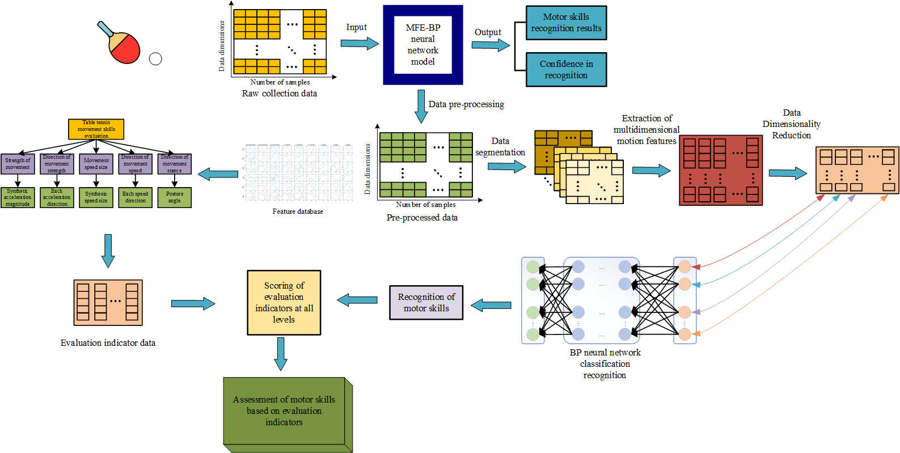
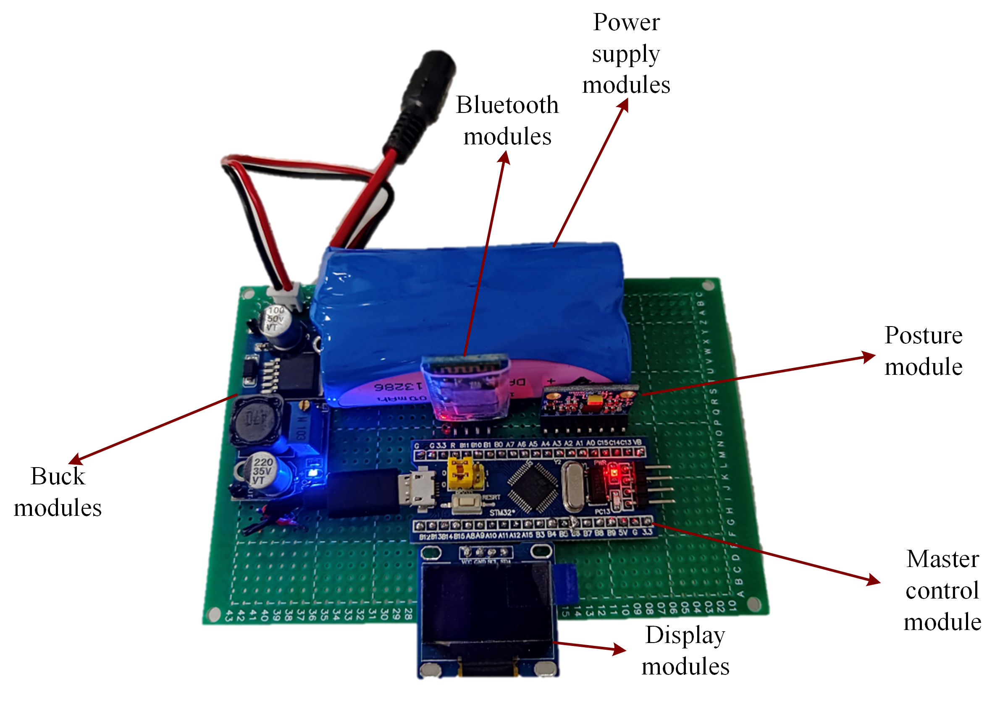
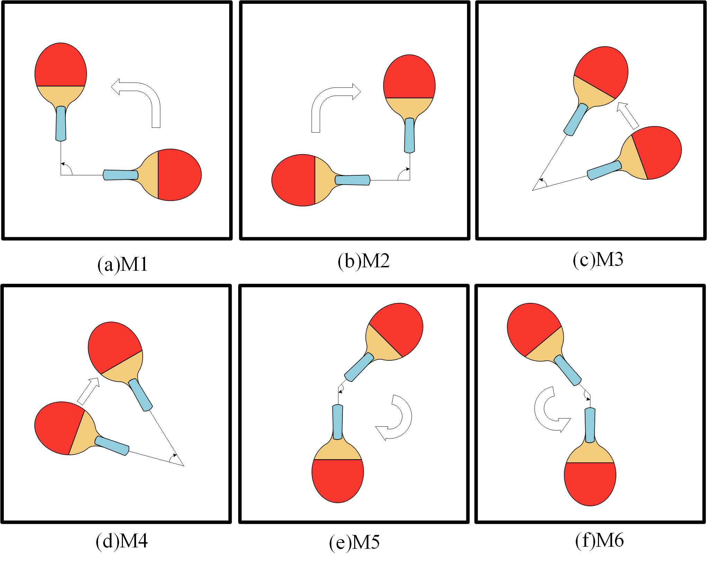
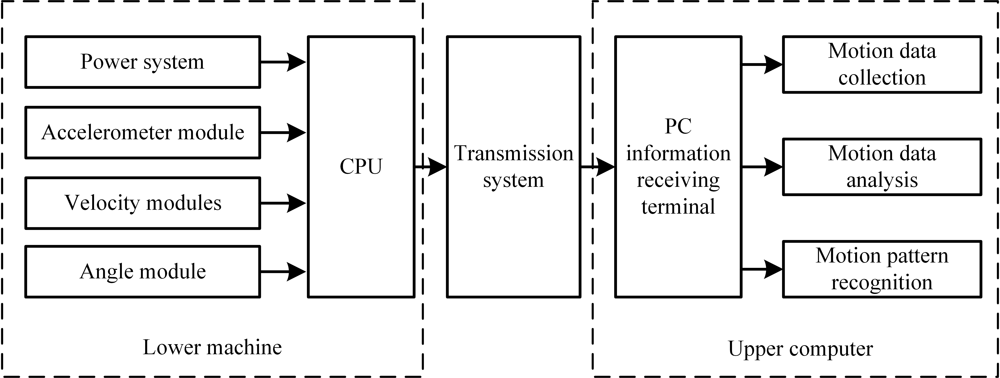
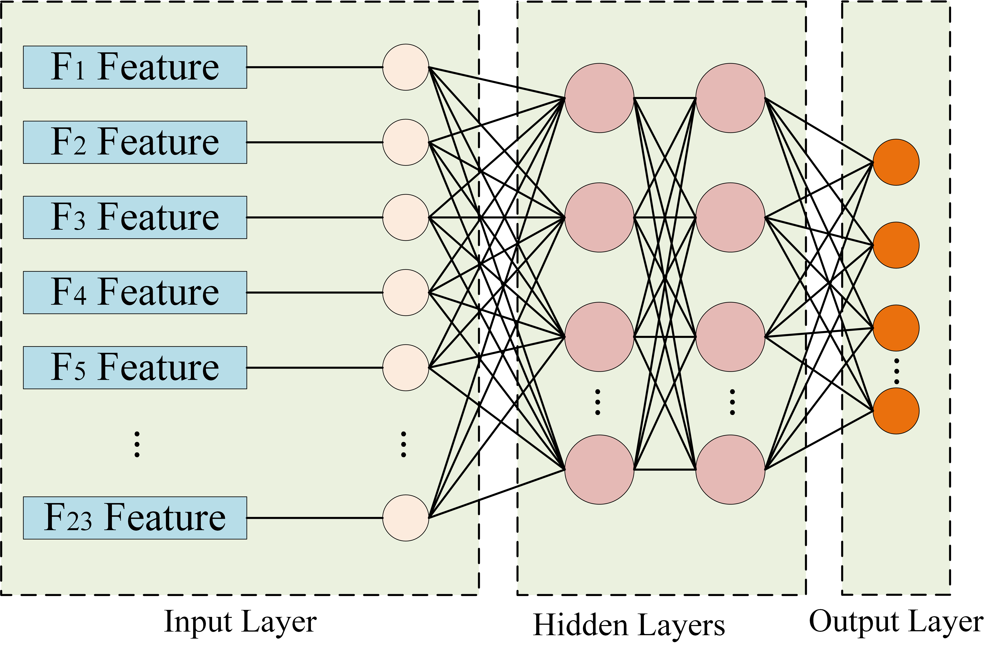
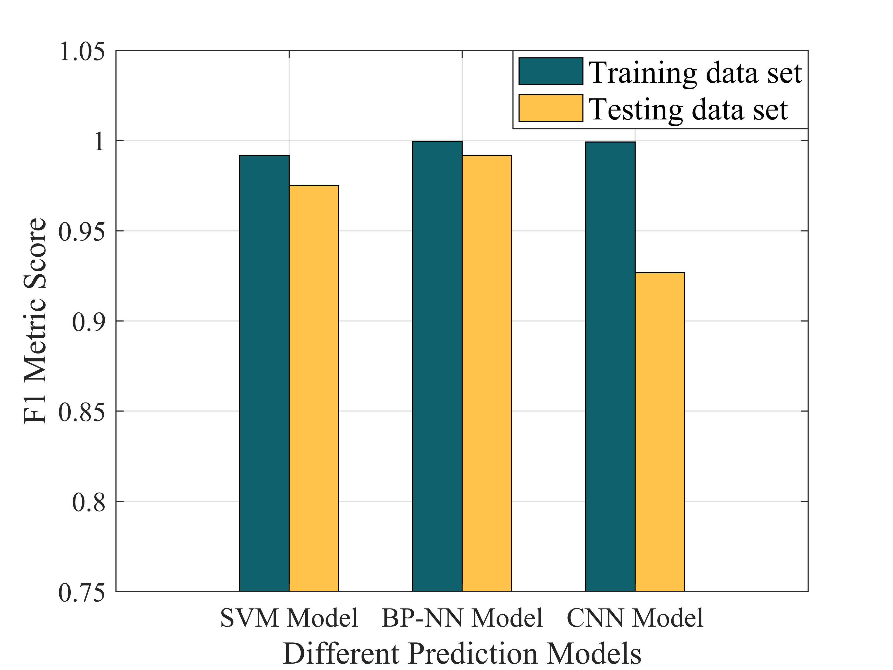

<!-- 🏓 Table Tennis Motor Skill Recognition & Evaluation System -->
<div align="center">

# 🏓 Table Tennis Motor Skill Recognition & Evaluation System  
*An AI-powered wearable framework for motion recognition and hierarchical skill assessment*


<p align="center">
<sub>Figure 1. Overview of the wearable acquisition and AI-based hierarchical evaluation system.</sub>
</p>

</div>

---

### 🧩 Overview  

This project presents an **AI-driven wearable sensing system** that recognizes, models, and evaluates fine-grained **motor skills in table tennis**.  
The framework integrates **multimodal IMU sensing**, **feature engineering**, and **hierarchical scoring**, enabling both *objective motion classification* and *quantitative skill evaluation*.

> Supported by **NPU Postgraduate Innovation & Practice Fund (PF2024067)**  

---

### ⚙️ System Architecture  

| Layer | Description |
|-------|--------------|
| **Hardware Layer** | STM32F103 + MPU6050 IMU + HC-06 Bluetooth for motion capture at 100 Hz |
| **Ingestion Layer** | Serial/BT data logging → CSV → synchronized multi-trial datasets |
| **Feature Extraction** | 180+ time–frequency–morphological descriptors → PCA (95% variance) |
| **Recognition Models** | BP Neural Network (Softmax) · DAGSVM multi-class decision |
| **Evaluation System** | 5D scoring: Strength · Force Direction · Speed · Velocity Direction · Posture |
| **Visualization** | Streamlit-based dashboard with radar and trend plots |

---

### 📷 Hardware & Benchmark Actions

<table>
<tr>
<td align="center" width="50%">

**STM32 Acquisition Hardware (100 Hz)**
  


<sub>Figure 2. STM32F103 + MPU6050 (I²C) + HC-06 (UART/Bluetooth) wearable acquisition node. 5 V→3.3 V LDO; I²C @ 400 kHz; UART @ 115200 bps.</sub>

</td>
<td align="center" width="50%">

**Six Benchmark Strokes (2×3 Grid)**
  


<sub>Figure 3. Benchmark actions: Forehand Attack, Forehand Push, Forehand Chop, Backhand Attack, Backhand Push, Backhand Chop. Consistent view angle & scale.</sub>

</td>
</tr>
</table>


---


### 🧠 Pipeline  


<p align="center">
  
  <br>
  <sub>Figure 4. Data flow pipeline from sensing to AI-based evaluation.</sub>
</p>


1. **Data Acquisition** — 6-axis IMU signals collected from wearable device during forehand/backhand strokes.  
2. **Preprocessing** — Filtering, resampling, and segmentation (1.5 s window, 0.3 s step).  
3. **Feature Engineering** — Statistical, spectral, and shape-based features extracted from each segment.  
4. **Model Training** — PCA → BP-NN / DAGSVM models with cross-validation.  
5. **Hierarchical Evaluation** — Physical parameters mapped to 5D normalized scores (0–100).  

---

### 🧩 Algorithmic Core  

<p align="center">
  
  <br>
  <sub>Figure 5. Model structure of BP Neural Network and hierarchical scoring logic.</sub>
</p>

#### 🧮 BP Neural Network  
- Two hidden layers (128, 64), ReLU activation  
- Adam optimizer, 200 epochs  
- Average recognition accuracy > 95%  

#### 🧩 Hierarchical Scoring  
| Dimension | Formula | Description |
|------------|----------|-------------|
| Strength | `S = 100 * min(1, |F_peak| / F_ref)` | Peak force ratio |
| Force Direction | `FD = 100 * (1 - θ/π)` | Angular deviation |
| Speed | `V = 100 * min(1, |v_peak| / v_ref)` | Speed efficiency |
| Velocity Direction | `VD = 100 * (1 - φ/π)` | Trajectory alignment |
| Posture | `P = 100 * exp(-|Δangle| / σ)` | Stability penalty |
> Final Score = Σ wᵢ · dᵢ ( wᵢ = 0.2 by default )

---

### 📊 Results  

<p align="center">
  
  <br>
  <sub>Figure 6. Model recognition performance and skill evaluation radar chart.</sub>
</p>


- **Accuracy:** 95.3% (BP-NN) | 93.7% (DAGSVM)  
- **Evaluation correlation:** R ≈ 0.93 with expert ratings  
- **Realtime latency:** < 0.2 s per inference  

---

### 💻 Quick Start  

```bash
conda env create -f env.yml && conda activate ttms
python preprocessing/preprocess.py --in data/raw --out data/interim --fs 100
python preprocessing/features.py --in data/interim --out data/features --win 150 --step 30
python modeling/train_bp.py --X data/features/X_pca.npy --y data/features/y.npy --save runs/bpnn.joblib
streamlit run app/streamlit_app.py

---

### 📖 Citation  

If you find this work useful in your research, please cite the following paper:

> Shi, Zhuoyong; Jia, Yetao; Zhang, Kai; Wang, Dong; Jia, Long; Wu, Yong.  
> **Design of a Motor Skill Recognition and Hierarchical Evaluation System for Table Tennis Players.**  
> *IEEE Sensors Journal*, 2024.  
> DOI: [10.1109/JSEN.2023.3346880](https://doi.org/10.1109/JSEN.2023.3346880)

```bibtex
@article{shi2024tabletennis,
  title={Design of a Motor Skill Recognition and Hierarchical Evaluation System for Table Tennis Players},
  author={Shi, Zhuoyong and Jia, Yetao and Zhang, Kai and Wang, Dong and Jia, Long and Wu, Yong},
  journal={IEEE Sensors Journal},
  year={2024},
  doi={10.1109/JSEN.2023.3346880}
}


